# Rapport

---

## Oppgave 1: Implementasjon av datamodellen, mermaid-diagrammet og normalform

... besvarelse ...
Denne følger 3NF siden den er ikke transitiv, altså at Bøker sin PK påvirker ikke Kontoer sine attributter utenom at den blir brukt som en FK.
Samtidig hvis jeg endrer navn og adresse så vil ikke dette påvirke tabellene som bruker Bøker som referanse 

Valgte å ha med forklaringen i Mermaid, siden å lese repo-en var for mye scrolling, 
en annen ting å ta opp er at Lot tabellen er ikke her, jeg skrev til Janis på mail og han svarte at vi ikke trengte å ha den med, dermed har jeg også fjernet det fra Posteringer tabellen
Siden dette vil bare være en unødvendig NULL som ikke kommer til å hjelpe med oppgaven.
Mermaid kode:
		
```mermaid
  erDiagram
   Bøker{
    CHAR(32) guid PK "Unik ID"
    TEXT navn	"Navnet på regnskapsboken ikke NULL"
    TEXT organisasjonsnr "Virksomhetens 9-sifrende organisasjonsnummer"
    TEXT adresse	"Addressen på Virksomheten"
    CHAR(32) rot_konto_guid "FK fra Kontoer legges inn etter opprettelsen"
    DATE regnskapsaar "Startdatoen for gjeldende regnskapsår"
   }
   Valutaer{
    CHAR(32) guid PK "Unik PK"
    TEXT kode "ISO 4217 (NOK/USD/EUR) unik og ikke NULL"
    TEXT navn "Fullt navn av kode, ikke NULL"
    INT desimaler "Antall desimalr valutaen operer med vanlig med 2 ikke NULL standarverdi 100 verdien må være over 0"
    INT hent_kurs_flag "Boolsk 1/0 systemet skal forsøke å hente kursen automatisk ikke NULL standaerverdi 0 sjekk at verdien er enten 0 eller 1"
    TEXT kurs_kilde "Standard kilde for automatisk kurshenting"
   }
   Valutakurser{
    CHAR(32) guid PK "Unik"
    CHAR(32) fra_valuta_guid FK "FK til Valutaer: valutaen som prises ikke NULL"
    CHAR(32) til_valuta_guid FK "FK til Valutaer: valutaene prisen er uttrykt i basisvaulta (NOK) ikke NULL"
    TIMESTAMP dato "Ikke NULL standaerverdi er når raden settes inn"
    TEXT kurs_kilde "Kilden til kursen"
    TEXT type "last, bid, ask, nav sjekk at verdien er en av disse"
    BIGINT kurs_teller "Brukes for kursverdi ikke NULL"
    BIGINT kurs_nevner "Brukes som nevner kurs_teller/kurs_nevner ikke NULL standaerverdi 100 sjekk at verdien er større enn 0"

   }
   Kontoklasser{
    INT klasse_nr PK "1-8"
    TEXT navn "Navnet på klassen ikke NULL og unik"
    TEXT type "BALANSE eller RESULTAT. Sjekk at verdien er enten Balanse eller Resultat"
    TEXT normal_saldo "DEBET eller Kredit angir hvilken side som øker saldoen. Ikke NULL sjekk at verdien er enten DEBET eller KREDIT"
    TEXT beskrivelse "Kort forklaring av formål"

   }
   Kontoer{
    CHAR(32) guid PK 
    CHAR(32) bok_guid FK "FK fra Bøker ikke NULL"
    CHAR(32) overordnet_guid FK "Selvhenvisning bygge hierarki"
    CHAR(32) valuta_guid FK "Valutaer FK ikke NULL"
    INT kontonummer "4-sifrede kontonummeret sjekk at verdien er mellom 1000 og 9999"
    INT kontoklasse FK "FK fra kontoklasse ikke NULL"
    TEXT gnucash_type "Underliggende Cash-Typen BANK eller EXPENSE"
    TEXT navn "Kontonavnet Bankinnskudd f.eks ikke NULL"
    TEXT beskrivlse "Utdypende beskrivelse"
    INT er_placeholder "Boolsk 1/0 Standardverdi er FALSE"
    INT er_skjult "Boolsk 1/0 Standardverdi er FALSE"
    INT mva_pliktig "Boolsk 1/0 Standardverdi FALSE"
    VARCHAR(32) mva_kode_guid FK "FK fra MVA_KODER Legges til etter opprettelse av MVA_KODER"
   }
   Regnskapsperioder{
    CHAR(32) guid PK "Unik"
    CHAR(32) bok_guid FK "FK til bøker ikke NULL"
    TEXT navn "navn på perioden (Januar 2026) ikke NULL"
    DATE fra_dato "ikke NULL"
    DATE til_dato "ikke NULL"
    TEXT status "AAPEN, LUKKET LAAST ikke NULL Standardverdi AAPEN sjekk for disse"
    
   }
   Transaksjoner{
    CHAR(32) guid PK
    CHAR(32) bok_guid FK "FK fra Bøker ikke NULL"
    CHAR(32) valuta_guid FK "Ikke Null fra Valutaer"
    TEXT bilagsnummer "Ikke NULL faktura/kvittering"
    DATE bilagsdato "Dato for bilagsnummer"
    TIMESTAMP posteringsdato "Datoen Transaksjonen skal regnskapsføres på, ikke NULL Standardveriden skal være tidspunktet for innsetting/oppdatering av raden"
    TIMESTAMP registreringsdato "Tidspunktet transkasjonen ble registret på ikke NULL"
    TEXT beskrivelse "Fritekstebeskrivelse av hendelsen ikke NULL"
    TEXT kurs_kilde "Hvordan transaksjonen ble opprettet Standardverdi er 'manuell' Sjekk at veriden er av 'manuell', 'import', 'planlagt'"
    varchar(32) periode_guid "FK til Regnskapsperioder ikke NULL"
   }
   Posteringer{
    CHAR(32) guid PK 
    CHAR(32) transaksjon_guid FK "Ikke NULL"
    CHAR(32) konto_guid FK "Ikke NULL"
    TEXT tekst "Notat av Transaksjonen"
    TEXT handling "Kjøp salg lønn sjekk om disse"
    TEXT avstemmingsstatus "n(ikke stemt), c(klarert), y(avstemt mot bank) Standardverdi n Sjekk for disse"
    DATE avstemmingsdato 
    BIGINT belop_teller "Positivt = debet, negativt = kredit ikke NULL"
    BIGINT belop_nevner	"Nevner for beløpet ikke NULL Standardverdi 100 Sjekk at den er større enn 0"
    BIGINT antall_teller "Antall enheter ikke NULL Standardverdi 0"
    BIGINT antall_nevner "Nevner for antall ikke NULL sjekk større enn 0"
   }
   MVA-koder{
    CHAR(32) guid PK
    TEXT kode "Ikke NULL Unik"
    TEXT navn "Utgående MVA, høy sats (25%) f.eks ikke NULL"
    TEXT type "UTGAAENDE, INNGAAENDE, INGEN ikke null Sjekk for disse"
    BIGINT sats_teller "Sats i teller ikke NULL"
    BIGINT sats_nevner "alltid 100 for prosent Standardverdi 100 sjekk større enn 0"
    VARCHAR(32) mva_konto_guid FK "MVA-beløpet skal posteres på. Ikke NULL"
    INT aktiv "Boolsk flag 1/0 om koden er i aktiv bruk, ikke NULL Standardverdi TRUE"
   }
   MVA-linjer{
    CHAR(32) guid PK
    CHAR(32) transaksjon_guid FK "Ikke NULL Fra Transaksjoner"
    CHAR(32) mva_kode_guid FK "Ikke NULL fra MVA_KODER" 
    BIGINT grunnlag_teller "Ikke NULL"
    BIGINT grunnlag_nevner "Standardverdi 100 sjekk større enn 0"
    BIGINT mva_belop_teller "Ikke NULL det beregnede MVA-beløpet"
    BIGINT mva_belop_nevner "Nevner for MVA-beløpet ikke NULL Standardverdi 100, Sjekk at den er større enn 0"
   }


   Bøker ||--o{ Transaksjoner : "Inneholder"
   Bøker ||--o{ Kontoer : "Inneholder"
   Bøker ||--o{ Regnskapsperioder : "definerer"
   
   Valutaer ||--o{ Valutakurser : "Regnes om på"
   Valutaer ||--o{ Transaksjoner : "Brukes til"

   Kontoer ||--o{ Kontoer : "er overordnet"
   Valutaer ||--o{ Kontoer : "Denominert i"
   Kontoer ||--o{ MVA_koder : "Bruker"
   MVA_koder || --o{ Kontoer : "Standard for"
   Kontoklasser ||--o{ Kontoer : "Klassifiserer"
   MVA_koder || -- o{ MVA_linjer : "parameter"
   
   Transaksjoner  ||--|{ Posteringer : "Inneholder"
   Transaksjoner ||--o{ MVA_linjer : "Constraint"
   Regnskapsperioder || -- o{ Transaksjoner : "Tilhører"
   
   Kontoer ||--o{ Lot : "Tilhører"
   Kontoer ||--o{ Posteringer : "Berører"


```

---

## Oppgave 2: RETTELSE

Jeg har brukt AI i denne oppgaven til å generere GUID, siden jeg ikke viste ikke om kommandoen REPLACE(gen_random_uuid()::TEXT '-', '')
Dermed brukte jeg AI til å generere 60 GUID for meg før jeg fante ut om dette. Også brukte jeg ikke SELECT INTO siden jeg lærte om dette etter jeg ble ferdig med oppgave 2.
Snakket med Janis og TA de sa jeg ikke trengte å REFAKTOR koden min.

---

## Oppgave 5: Ytelsesanalyse med `EXPLAIN ANALYZE` og `MATERIALIZED VIEW`

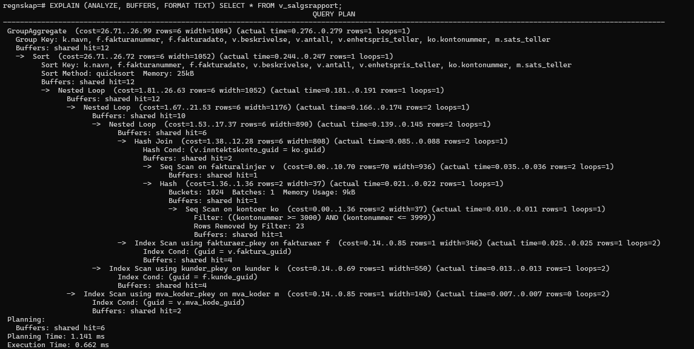

DEL B

`Hvilken join-algoritme valgte PostgreSQL (f.eks. Hash Join, Nested Loop)?`
Den valgte Hash Join og Nested Loop.

`Hva er den totale estimerte og faktiske kjøretiden?`
Den estimerte tiden var 1.141ms og den faktiske kjøretiden er 0.622ms

`Identifiser den operasjonen som bruker mest tid (høyest actual time).`
Det var GROUP BY aggregeringen som var en actual time på 0.276..0.279

DEL D

`Hvorfor er det materialiserte viewet raskere for lesing?`
Materialiserte viewen lagrer data-en man kan tenke seg at den tar et skjermbilde av viewen, og for hver gang du tilkaller den så vet den hva den skal sende.

`Hva er den fundamentale ulempen (stikkord: datakonsistens, REFRESH MATERIALIZED VIEW)?`
Problemet med Materilisert view er at den er alltid "utdatert", siden den lagrer data-en så vil den aldri være oppdatert helt til vi kjører en REFRESH MATERIALIZED VIEW
Det er en god praksis å ha en trigger som gjør dette i et tidsaspekt.
Dette kan også føre til datainkonsistens, siden hvis noen har oppdatert tabellene eller satt inn noe nytt i den så vil ikke dette bli ført i viewen før vi har refreshet den.

`I hvilke situasjoner er et MATERIALIZED VIEW uegnet, og hva kan brukes i stedet?`
Et materialized view er uegnet for VIEWs som skal bli brukt for store databaser hvis du ikke har lagringsplassen tilgjenglig for dette, siden viewen er på en måte lagret på maskinen så tar dette ekstra plass.
Hvis vi tar forrige oblige med sykkel stasjonen i Stasjons-tabellen hvor den viser oss hvilke sykler som er i bruk og hvilke som ikke er det i ekte tid, så vil ikke MATERIALIZED VIEW fungere sånn som vi vil; siden da er vi nødt til å bruke et vanlig VIEW.
Vi kunne ha brukt REFRESH funksjonen, men igjen dette vil være unødvendig belastning på databasen våres.

Det vi kan bruke istedenfor MATERIALIZED VIEW er Redis, hvor vi kan lagre data i RAM-en istedenfor disken og Cache den. Men dette er en NOSql funksjon, hvor vi må lage en hybrid database med NOsql med postgres noe som "jeg" kommer til å lage senere i oppgaven.

... besvarelse ... (der det står at man skal svare/forklare/diskutere i rapporten)

--- 

## Oppgave 6: Databaseadministrasjon og Tilgangskontroll

... 
besvarelse

`Forskjellen mellom Role og USER`
Forskjellen på en ROLE og en USER er at en ROLE kan man ikke logge seg inn på, man bruker en ROLE for å samle rettigheter også bruker man en USER til å koble til en database.
Begge to er global gjennom alle databasene, altså at alle databasene i clusteren kan bruke rolene og user som du har opprettet. 
ROLES kan også eie objekter altså tables og functions, dette vil si at hvis jeg er regnskapforer og klarer å lage en ny tabell, så vil dette si at jeg som er OWNER og superbrukeren kan bare INSERTE, DELETE og UPDATE PÅ DEN. 
Tilslutt så kan du også gi "privileges" fra en ROLE til en ROLE, dermed så kan en ROLE bruke en annen ROLE sine premisser (Membership er navnet på dette). noe som du ikke kan med USERS "direkte" altså det er dårlig praksis.

`God praksis med roller istedenfor Brukere`
Det er god praksis å fordele roller istedenfor brukere, siden hvis vi har 4 admins så kan vi lage bare en admin rolle og tildele alle nødvendigerettighetene til den rollen også vil automatisk brukerene få disse. Altså at vi slepper å skrive så mye kode for å gjøre det samme.
En annen ting er at det blir vanskelig å oppdatere brukere individuelt også, hvis det kommer et nytt premiss så vil det ta tid å oppdatere alle brukerene. Samtidig som jeg nevnte over er at Roller kan få privileger fra andre Roller dette er noe USER "kan" også gjøre, men er dårlig i praksis.
Tilslutt hvis en bruker blir sparket og vi dropper Brukeren hans så vil et problem oppstå, og det er rettighetene til tabeller som han har, den vil ikke la oss slette brukeren hans før tabellen er kortsagt slettet eller tildelt nye eiere.

`Hvilken fordel gir RLS forhold til GRANT`
Fordelen med RLS er at vi kan gjøre checks for at personer skal bare se hva de trenger bare å se, dette kan spare oss penger og tid mtp spørringer og arbeidet til ekstern_revisor f.eks.
I oppgaven så blir vi bedt om at vi skal enable RLS på Transaksjoner tabellen med premisse at de skal kunne bare se det året vi er i og ingenting før eller etter. 
En god grunn for dette er at en revisor er betalt i timen, og at den personen skal se gjennom Transaksjoner som ikke har noe å gjøre med året er unødvendig for de og oss.
Forskjellen på GRANT og RLS er at en GRANT så vil han ha alle muligheten til å se alt, dette er også indriekte BRUDD på GDPR.
Et problem med RLS er at hvis vi ikke tildeler POLICY på brukere som skal ha det, så vil den gi oss en blank spørring altså en DENY, dette skyldes for sikkerhet fra Postgresql sin side for brukere/roler som ikke er med i POLICY-en.

`Hvis vi tar en spørring fra databasen konkret eksempel:`
Hvis jeg er rollen ekstern_revisor og gjør denne spørringen SELECT bilagsdato FROM Transaksjoner;
Med den POLICY-en jeg har laget så vil vi kunne se bare til 2026-01-01 som tidligste dato
Men hvis vi er revisor eller dba_ola så har jeg laget en Transaksjon og en Regnskapsperiode som er i 2024, og den kan vi se med samme spørring.

... (der det står at man skal svare/forklare/diskutere i rapporten)

---

## Oppgave 7: Atomisk Regnskapspostering (K10.1, K10.2) 

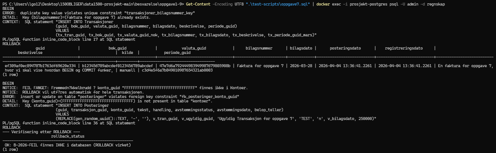
Bilde av fullført kjøring av koden.

... besvarelse ... (ja, se Rapportkrav)
`Hva ville ha skjedd uten transaksjonsbehandling dersom systemet krasjet mellom innsetting av Transaksjoner-raden og Posteringer-radene?`

Uten transaksjonenbehandlingen så hadde operationen ikke vært atomisk, siden at DO psql-blocks villa ha "kræsjet" og hvis vi hadde fjernet BEGIN; så hadde hver innsetting av en rad vært sin "egen" rad uten tilknyttelse til den andre.
Hvis vi ikke hadde hatt Exceptionen så hadde vi hatt en transaksjon uten en postering også.
Hvor vi bryter Dobbelt bokholderiet. og hatt en rad i databasen uten noen tilknyttelse til noe annet, hvor databasen hadde vært i en inkonsistent tilstand som bryter ACID prinsippet.

`Forklar hvilken av ACID-egenskapene som er mest kritisk for dobbelt bokholderi, og begrunn svaret.`

Jeg mener at A(Atomicity) er den viktigste:
Grunnen hvorfor Atomicity er den viktigst er siden hoved poenget med dette premisset er `alt eller ingenting`. 
Dette er viktig for dobbelt bokholderi siden vi må alltid føre begge siden av transaksjonen og alt som skjer rundt transaksjonen; er det debet eller kreditt, hvilken konto er det snakk om? Hvem gjør dette og hvordan påvirker dette oss + hvor skjer dette og når.
Dermed så skal alle operasjonene være korrekte og fullføres for å bli lagret permanent, og hvis noen av de ikke fullføres så skal alt bli slettet.
F.eks hvis transaksjon 1 feiler etter den er ferdig, men den starter på transaksjon 2 så vil dette gjøre databasen våres inkonsistent og lage anomalier og poster uten tilknyttelse
Som nevnt ovenfor enten blir alt lagret og ført eller ingenting. 
Man kan også si at C(Consistency) er en medfølge av dette også, siden uten konsistent data i INSERT INTO blokken, så vil ikke databasen ha mulighet til å kjøre heller. Som går i ett med Atomicity, men for å oppnå Consistency så må vi ha Atomcity først.
 

## Oppgave 8: Feilhåndtering og Gjenoppbygging (K10.3, K10.4, K10.5, K10.6)

... besvarelse ... (ja, teoretisk del skal besvares i rapporten)

`Hvilke transaksjoner skal REDO-es etter krasjet, og hvilke skal UNDO-es? Begrunn svaret.`
Det som skal REDO-es er linje 6 og 7, siden dette er det eneste som har fått på virkning på databasen direkte. 
Linje 8 og 9 må Undo-es siden denne blokken med kode har inkonsistent og har ikke noe tilknyttelse til blokken og har ingen "Hode" 

`Forklar rollen til sjekkpunktet (linje 5) i gjenoppbyggingsprosessen. Hva ville ha vært annerledes uten det?`
Rollen til sjekkpunkt er at hvis blokken med kode er stor, så kan man legge inn sjekkpunkter i koden som vil hjelpe oss i tilfelle at noe kræsjer, strømbrudd eller media feil.
Dette vil hjelpe oss med at vi trygt slipper å Redo og Undo alt og vi kan bare starte fra sjekkpunktet og ikke mistet så mye data og spare tid på å kjøre koden om igjen.
Hvis den ikke har vært der så måtte vi ha Redo-et alt helt til kræsjet og Undo-et rett før kræsjet, samtidig så må vi også kjøre koden på nytt igjen avhengig av størrelsen på koden så kan dette ta lang tid.

`Forklar forskjellen mellom en instansfeil (f.eks. strømbrudd) og en mediefeil (f.eks. diskkrasj), og hvilken rolle sikkerhetskopiering spiller for sistnevnte.`
Når man får en instansfeil/strømbrudd så vil filene i databasen være inkonsistent som kan føre til korrupte filer i databasen. 
Postgresql har en innebgyd funksjon som kan hjelpe med dette som heter WAL(Write Ahead Log), denne funksjonen har en innebygde sjekkepunkter og redos som vil hjelpe oss med å gjenoppbygge data-en som har blitt korrupt. Siden den vet at alt informasjon før den siste WAL sjekkpunktet er i disken.
Dette er en dyr prosess derimot og derfor har Postgres satt en spesifikk tid til å flushe og lage en save for hver time, eller når disken har nådd 1GB. Grunnen hvorfor den gjør dette er fordi I/O blir svært belasted av å ha så mye skitten data.

Mediefeil/Diskkrasj er når disken har en mekanisk feil(PCB er ødelagt) eller eletronisk feil(Partition feil). 
Hvis disken er fysisk ødelagt så kan man replace PCB, men dette fungerer svært sjeldent på nyere hard drives. Hvis man har en partition feil, så vil dette si det området på disken du prøver å nå er i en dårlig tilstand. 
Du kan fikse dette med å kjøre programmer som Disk Recovery på Windows eller installer et eksternt programm.

En forskjell på disse to er at en er feil du ikke kan få gjort noe med, altså strømbrudd. (Hvis du ikke har en UPS f.eks) Hvor du har en WAL log som kommer til å gjenoppbygge databasen, men den kan være inkonsistent og den vil automatisk REDO og UNDO for deg, men du må muligens REDO og UNDO enkelte Transaksjoner manuellt.
Når det kommer til diskkrasj så er dette noe du kan håndtere avhengig av hvilken type diskkrasj du har.
Du kan allokere hvor på disken tabellen er altså at den ikke har mulighet til å overskrive selv om postgres ikke tillater at dette skjer, hvor WAL skal skrives til (Hvilken disk/hvor på disken), lage checks for når disken nærmer seg full. Bruke `VACUUM` kommandoen til å klargjøre tabeller som ikke blir brukt etter en update eller delete av en rad.

En annen forskjell er at Instansfeil har en sjanse for å korruptere filene dine, som nevnt ovenfor med sjekkpunkter både innebygde i postgres og WAL; Dermed er det viktig å ha sjekkepunkter i koden din hvis det er en stor blokk i tilegg til postgres sine.
Forhold til mediefeil, hvor du har transaksjon logger av hva som har skjedd og WAL loggen som du kan bruke til å hente tilbake data-en som har blit påvirket.

Den siste forskjellen er at data-en i en mediefeil kan være veldig vanskelig å få tilbake, dette skyldes av hvilken feil er det med HDD/SSD-en, hvis det er en partition feil så kan mann bruke programmer til å få tilbake informasjon.
Hvis selve magnet-belegget er ødelagt så vil man få store problemer, hvor vi vil bare få fragmenterte deler av den.
Og tilslutt hvis den overskriver på disken så vil problemet være større siden det er ikke en bra måte å få tilbake informasjonen på tapt/overskrevet data

Når det kommer til sikkerhetskopiering så er det viktig at mann ikke sletter loggene som WAL og Transaksjon lager den gjør det automatisk for deg, siden dette kan føre til tap av data i store mengder. Det er viktig å behold WAL loggen og Transaksjon loggen for å unngå dette.
Derfor har postgres navngitt disse filene på en måte at man ikke skal slette de, dette vil føre til full korrupsjon av data-en din og eneste som vil hjelpe deg da er å ha en backup.
En god praksis er å kopiere WAL loggen til en annen disk eller server, hvis tilfeldigvis disken blir ødelagt.

`Oppgave 8b`
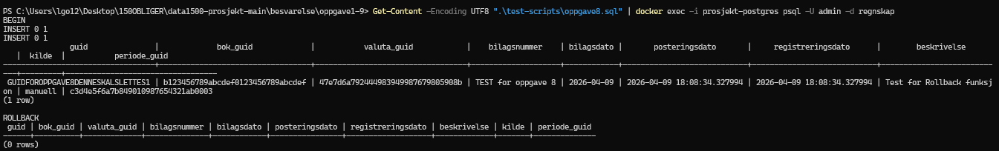

---

## Oppgave 9: Samtidighetsproblemer og Låsing

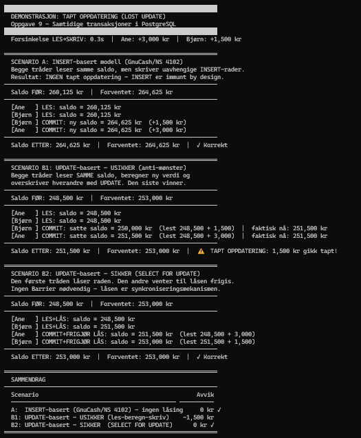

*Hvordan samtidighets i python-koden*
Sånn man ser på python koden så ser mann at samtidighet i python koden er at vi må enten lese koden etter hverandre også commite den, men vi kan ikke oppdatere begge verdiene etter hverandre og overskrive de.
Vi kan låse radene derimot som vi ser i koden er en synkroniseringsmekanismen og dermed INSERT.

Transaksjoner er implementert i python koden med at vi må låse de etter hverandre, eller så må vi lage uavhengig INSERT rader istedenfor å bruke UPDATE.

Den er mere sårbar siden du tar ikke med ørene i regningen og at alt skal bokføres på DEBET elle KREDIT.
Siden hvis du har bare en saldo så kan den saldoen være lett å Update/Inserte feile tall inn som vil gi oss ingen consistency, durability og isolation. 
Men hvis du har DEBET og KREDIT så kan du se om du skriver feil med en gang siden det må dobbelt bokføres.

---

## Oppgave 10: Sanntids Valutakurs-Cache med Redis

... besvarelse ... (der det står at man skal svare/forklare/diskutere i rapporten)
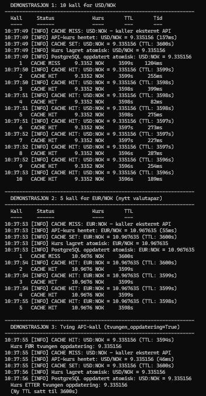
`Forklaring:`

`10 påfølgende kall for samme valutapar`
Hvis vi ser på Demonstrasjon 1, så ser vi at det første er en CACHE MISS, dette vil si at vi direkte kaller på API-en for første gang og vi kan tenke oss at dette er en *cold start* Dette er et begrep brukt i RAM som betyr at når vi kjører noe for første gang så vil RAM-men være "treg" siden det er første gang vi brukre RAM-en for denne transaksjonen/oppgaven vi ber den gjøre.
Første kallet(MISS) tok hele 1204ms på min datamaskin, altså 1.2 sekunder og fikk en kurs på 9.3352 NOK. Deretter kaller vi den opp igjen og denne gangen så bruker vi 255ms altså 1/4 CA av tiden på å kalle på den, denne tiden til meg gikk opp å ned fra 399ms til 82ms helt til den stabiliserte seg rundt 250ms.
Dette skyldes at vi tar informasjonen direkte fra første kallet og når vi kaller den oppigjen i *cachen* så får tilgang til informasjonen raskere noe som er styrken til REDIS. TTL(TIME TO LIVE) er jo 3600s altså 1 time noe som vi har valgt selv.

`Hva lagres på postgresql`

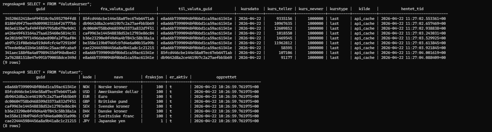

Når jeg kjørte disse to spørringene *SELECT * FROM "Valutakurser";* og *SELECT * FROM "Valutaer";*
Så fikk jeg se hva som har blitt lagret og når, her ser vi at vi har 8 forskjellige kurser som vi kan bruke til å konverte til norske valutaer om de er aktive eller ikke. 
Hvilken kilde jeg har fått de fra (api_cache), hvilken type det er *last* og hvor mye desimaler vi jobber med; i denne sammenhengen så jobber vi med 6 desimaler og deler den med 100000 i nevner også for å få f.eks 9.335156 istedenfor 9335156.

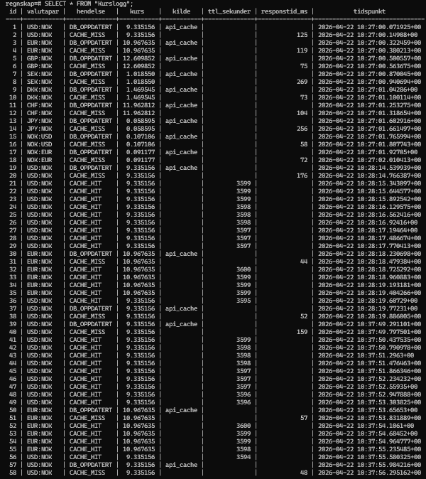
Dette vil jeg si er viktigst og vil hjelpe oss som utviklere mest mtp GDPR, Trigger og forstå hvem som gjør hva.
Siden når jeg kjørte spørringen *SELECT * FROM "Kurslogg";* så fikk jeg jo en logg, men denne loggen er spesiell siden på denne loggen kan jeg se alt som har skjedd når jeg kjørte demo.py
Jeg kan se når Databasen oppdateres, når vi får en HIT eller MISS, hvilken kurs vi har fått responstid i ms, TTL og tidspunktet når vi gjorde det. 
Dette er grunnen min hvorfor dette er viktig for oss som utviklere: hvis du ser på id 2 så ser vi også cache miss-en på når vi kallet API-en for første gang på USD:NOK, og hvis vi ser på ID 19 til og med 29 så kan vi også se de 10 gangene jeg kallet på den også og dette kan hjelpe oss mye.
Fordi hvis vi hadde laget en trigger som viser oss også hvilken bruker har gjort dette så kunne vi også sett hvem gjør hva i jobbsammenheng mtp GDPR, samtidig hvis noe kræsjer og WAL ikke fungerer som den skal eller noe blir overskrevet så har vi loggen vi kan dobbelt sjekke med for å finne ut hvilke verdier vi er intressert i å bruke.

`Datakonsistens og transaksjon`
Hvis vi tar CAP teoremet, så vil vi se at C står for konsistens og dette vil si alle transaksjonene skal operer med samme kopi av nodene til enhver tid. 
Hvis kursen oppdaterer seg rett etterpå så burde vi vurdere å kjøre transaksjonen omigjen med den nye kursen eller ha en Trigger for hver gang vi legger inn en Transaksjon så skal den dobbelt sjekke med Valuta-en om den er lik eller ulik før vi setter den inn, hvis det er en ny kurs så vil vi få en exception som sier til oss at vi må lese in transaksjonen på nytt igjen.
En annen måte vi kan håndtere dette på er å ha lavere TTL, men da vil vi bare sette et plaster på såret. 

--- 

## Oppgave 11: Staging av Finansielle Dokumenter med MongoDB 

... besvarelse ... (der det står at man skal svare/forklare/diskutere i rapporten)
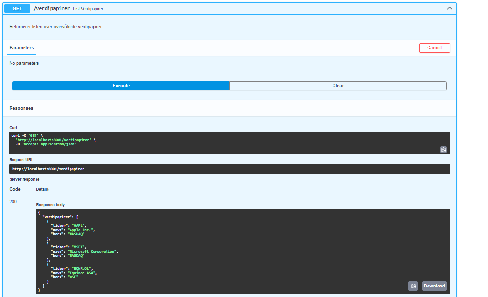
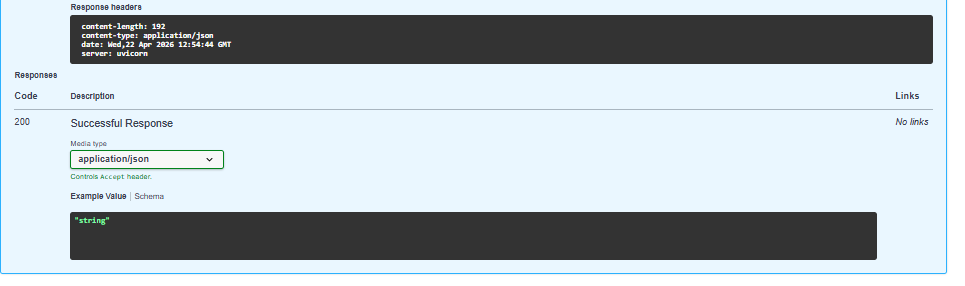

Her ser vi at databasen er oppdatert med å hente de tre ulike verdipapirerene vi har AAPL, MSFT og EQNR. OL fra SwaggerP nettsiden

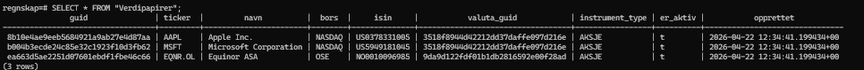

Og her ser vi inne i databasen at disse 3 verdipapirene er også oppdatert i databasen.

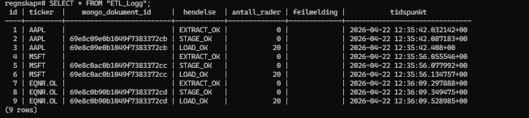
Her ser vi alt fra loggen: hendelse(Extract, staging, load), ticker(Hvem sin aksje), antall rader og hvilket tidspunkt den er kjørt i, tidspunktet er riktig forhold til når jeg kjørte scriptet i demo.py

`Fordel med å beholde rådataen`
Grunnen hvorfor det er en fordel å beholde rådata-en i mongoDB er fordi vi kan se historikken på når noe har skjedd: Når vi kjøpte denne aksjen, hvem kjøpte den/hvilken type aksje er det(MTP trigger og om vi implementer dette i virkeligheten), hvilket tidspunkt, hvor mye kjøpte vi og hvordan skjedde transaksjonen.
Når jeg kjører denne kommandoen db.raw_financial_data.find() så får jeg en BSON som er en Binary javascript Object Notation, når jeg ser på resultatet av koden så kan jeg se alt fra hva kursen kostet når dagen startet til slutten av dagen, hvor mye volum som ble kjøpt og hvor mange kurser vi ser, dette blir lagret som et Objekt for hvert tidspunkt.
Dette vil hjelpe oss med feilsøking hvis vi får noen feil når vi prøver å implementere dette i databasen våres, siden vi kan se på rådata-en sammen med loggen til å se hva som har skjedd feil, Hvis f.eks at noe overskrives i loggen eller noe feiler i loggen mtp en dirty read eller noe så kan vi se på rådataen og faktisk se hva som skal stå der.
Dette vil hjelpe oss med å kjøre transaksjonen om igjen med riktige verdier, som vil hjelpe med ACID og CAP.

---

## Oppgave 12: Refleksjon i forhold til læringsutbytte 

... skriv din refleksjon rundet læringsutbytte i forhold til planlagt læringsutbytte  i DATA1500 ... 

Denne oppgaven har faktisk vært veldig morsomt, jeg valgte å gjøre denne oppgaven individuelt og grunnen hvorfor er fordi jeg føler at jeg liker å være en backend dev og jeg liker databaser dermed så ville jeg jobbe alene for å lære mest.
Jeg har brukte veldig mye tid på denne obligen, men det tenker jeg ikke noe over siden jeg likte oppgaven veldig. jeg lært også veldig mye med å jobbe med denne obligen, alt fra anonyme blocks, hvordan å indeksere, views og mere teori bak hvorfor databaser har utviklet seg som de har inkludert CAP og ACID prinsippet.
Eneste problemet mitt er at det er svært lite dokumentasjon på hva som er rett og galt, det er litt mere hva personer tenker. Og det er svakt med dokumentasjon ellers, men det følte jeg ikke var et problem siden jeg hadde mulighet til å prøve 4 tinger før jeg fant den metoden jeg mente var rett.
Dette er noe du ser i oppgaven min også, på starten så er den litt her og der, men nærmere slutten så er den mye mere ryddigere og nivået øker. Så neste gang jeg jobber med en lignende oppgave så vet jeg iallefall hvordan jeg skal jobbe mest effektivt.

Noe som jeg likte i slutten, er at vi får litt mongoDB og Redis, jeg har bare hørt og lest litt om det, men å faktisk få noe ferdig lagd sånn at jeg kan se på det og tolke det har hjulpet meg mye med å forstå det.
Og forstå hvordan i prinsipp transaksjoner fungerer innenfor ACID prinsippet har også hjulpet meg mye, siden jeg brøt det prinsippet veldig mye når jeg jobbet med databasen helt til jeg endelig fikk det faktisk til.
Denne oppgaven hjalp meg også til og med forstå hvordan man skriver markdown filer og forstå yml filer uten å tenke på det.

For grupper skriver hver gruppemedlem sin egen refleksjon. 

SLUTT.

